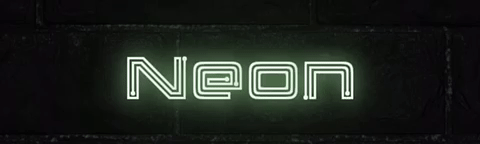

# neon



A Flutter plugin that allows you to use beautiful neon signs in your app.
[Link](https://pub.dev/packages/neon)

## description

As it is mentioned above, the plugin allows you to put neon style'sh signs into your app.
There are several parameters for tunning:

*String* **text** - the actual text of the sign

*MaterialColor* **color** - text's color

*double* **fontSize** - text's size

*NeonFont* **font** - build-in fonts for the text:

    - Automania
    - Beon
    - Cyberpunk
    - LasEnter
    - Membra
    - Monoton
    - Night-Club-70s
    - Samarin
    - TextMeOne

*bool* **flickeringText** - if the parameter is true text will be flickering with random frequency

*List<int>* **flickeringLetters** - indexes of the letters in the text that will be flickering (if the parameter is null and flickeringText == true all the text will be flickering)

*double* **blurRadius** - radius of the blur effect

*bool* **glowing** - glowing parameter (glows if it's true)

*Duration* **glowingDuration** - the duration of the glowing

*TextStyle* **textStyle** - custom style for the text

## code example

```dart
Neon(
    text: 'Retro',
    color: Colors.green,
    fontSize: 50,
    font: NeonFont.Membra,
    flickeringText: true,
    flickeringLetters: [0,1],
)
```